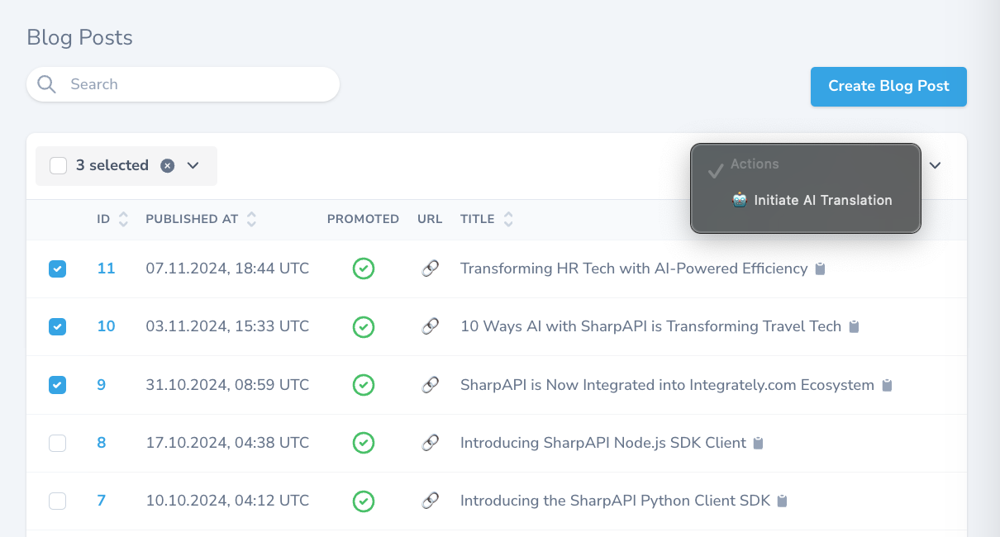
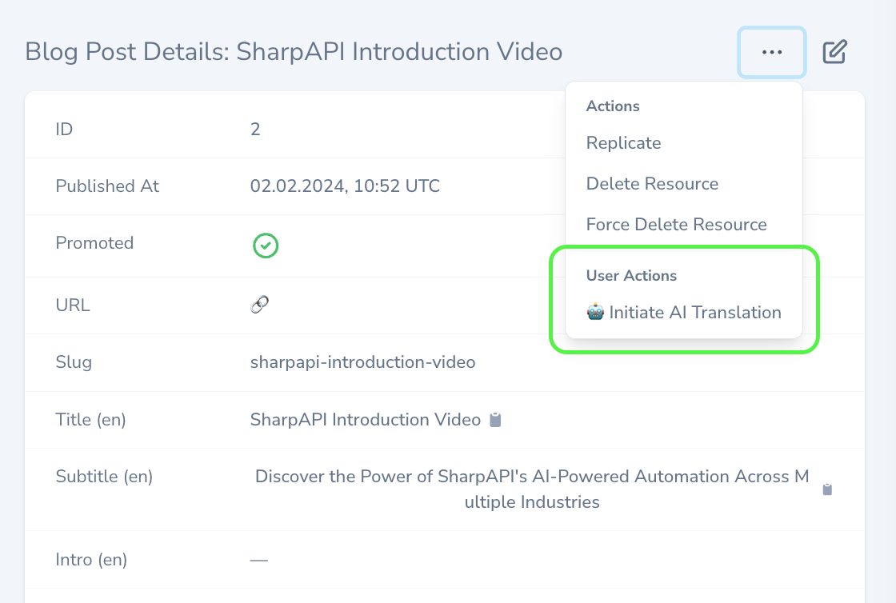
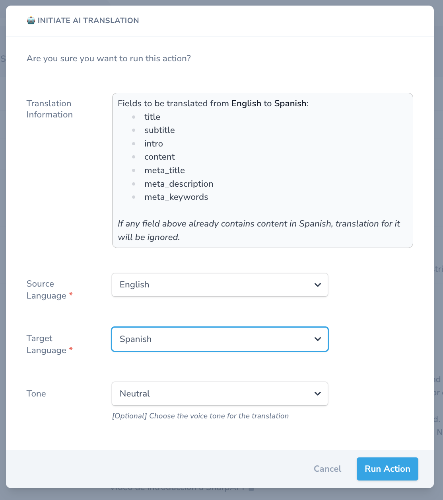
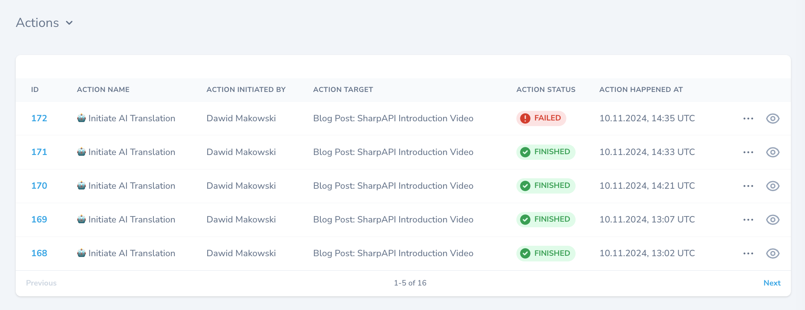
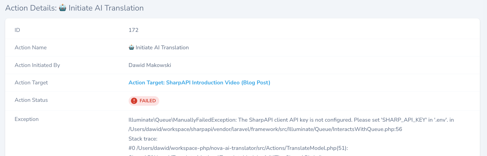

# SharpAPI Laravel Nova AI Translator

The SharpAPI Nova AI Translator is a Laravel Nova package 
that automates content translation 
using the SharpAPI.com to leverage [AI for Laravel](https://SharpAPI.com/). 
This package extends [Spatie's laravel-translatable package](https://spatie.be/docs/laravel-translatable/) 
and provides Nova actions that can be triggered from resource
edit screens to translate translatable fields between 
languages defined in the Laravel `config/app.php` configuration.


`🤖 Initiate AI Translation` action can be started either from Nova resources list:
> 

**OR** from the preview mode of the individual Resource.
 > 

The form to dispatch translations process:
> 

## Requirements

- **Laravel**: ^9.0
- **Laravel Nova**: 4.0+
- **PHP**: 8.0+
- **spatie/laravel-translatable**
## Installation & Configuration

### 1. Install the package via Composer:

```bash
composer require sharpapi/nova-ai-translator
```

### 2. API Key Configuration:

The package requires an API key from [SharpAPI.com](https://SharpAPI.com/), configured in the `.env` file:

```
SHARP_API_KEY=your-sharp-api-key
```

### 3. Supported Locales Configuration:
Add the supported locales in `config/app.php` under the `locales` key:

```php
return [
   'locales' => [
       'en' => 'English',
       'es' => 'Spanish',
       'fr' => 'French',
       // add other supported languages here
   ],
];
```

### 4. Add to Nova Resource Models:

For any model that requires translation, ensure it:
- Uses Spatie’s `HasTranslations` trait.
- Defines `translatable` attributes.
- **[OPTIONAL but RECOMMENDED]** Include the Nova `Actionable` and `Notifiable` traits for logging.

```php
namespace App;

use Laravel\Nova\Actions\Actionable;
use Illuminate\Notifications\Notifiable;
use Spatie\Translatable\HasTranslations;

class BlogPost
{
   use Actionable, Notifiable, HasTranslations;

   protected $translatable = ['title', 'subtitle', 'content'];
}
```

### 5. Integrating the Translator with Nova Resources

**Define the Action in a Nova Resource**:
   Attach the `TranslateModel` action to a Nova resource, such as `BlogPost`.

```php
use SharpAPI\NovaAiTranslator\Actions\TranslateModel;

public function actions()
{
   return [
       (new TranslateModel())->enabled(),
   ];
}
```


### 6. **Queue Setup**:
The `TranslateModel` action is designed to run in a queue. Ensure your application has a queue setup for optimal performance and background processing.

---

## **Using the TranslateModel Action**:

- From the resource’s edit screen, trigger the `TranslateModel` action.
- A form will appear, allowing you to select source and target languages and specify an optional tone.
- The action checks if fields in the target language already contain content. If all fields are populated, a message will indicate that translation cannot proceed until the fields are cleared.
- Once executed, the translation job will be queued, and progress can be monitored if the `Actionable` and `Notifiable` traits are applied to the model.

### Comments & Tips

- Example of translations action log:

- Enabling `Laravel\Nova\Actions\Actionable;` inside the model helps with potential debugging, when queued Action fails for some reason.
  
---

## Changelog

Please see [CHANGELOG](CHANGELOG.md) for more information on what has changed recently.

---

## Credits

- [A2Z WEB LTD](https://github.com/a2zwebltd)
- [Dawid Makowski](https://github.com/makowskid)
- Boost your [Laravel AI](https://sharpapi.com/) capabilities!

---

## License

The MIT License (MIT). Please see [License File](LICENSE.md) for more information.

---
## Social Media

🚀 For the latest news, tutorials, and case studies, don't forget to follow us on:
- [SharpAPI X (formerly Twitter)](https://x.com/SharpAPI)
- [SharpAPI YouTube](https://www.youtube.com/@SharpAPI)
- [SharpAPI Vimeo](https://vimeo.com/SharpAPI)
- [SharpAPI LinkedIn](https://www.linkedin.com/products/a2z-web-ltd-sharpapicom-automate-with-aipowered-api/)
- [SharpAPI Facebook](https://www.facebook.com/profile.php?id=61554115896974)
